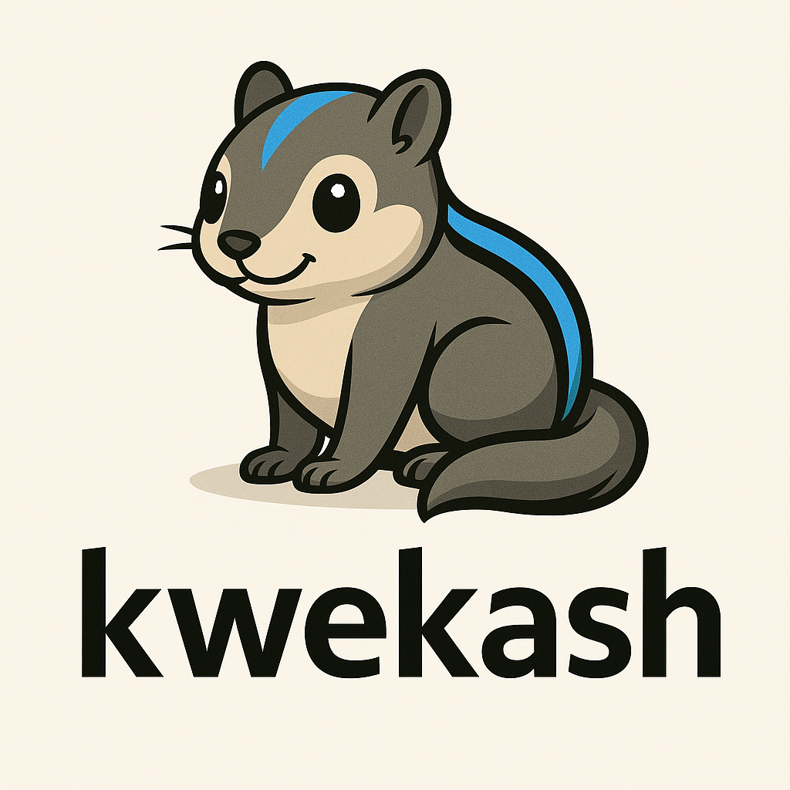
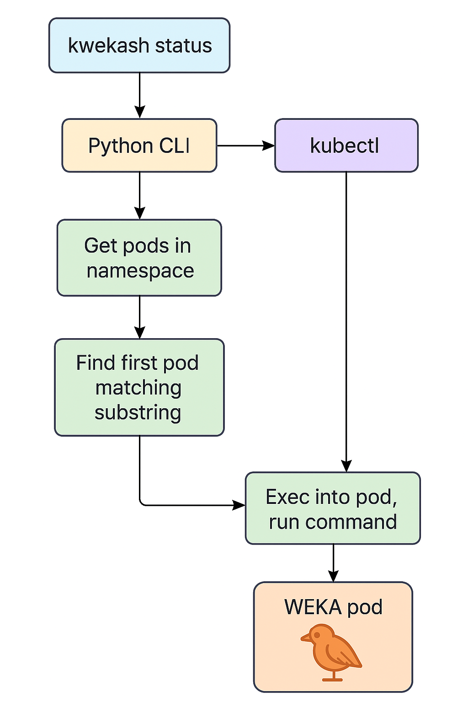

# kwekash


**kwekash** is a Python CLI tool for running `weka` commands inside the first matching WEKA pod in your Kubernetes cluster.  
It supports real-time monitoring, interactive shells, multiple clusters, and flexible pod targeting.

---

## ✨ Features

- Run any `weka` CLI command inside the cluster.
- Target specific pods by substring (`--pod-match`) and namespace (`--namespace`).
- Use `watch` mode to refresh output in real time.
- Open interactive shells with `-it`.
- Works with both `kubectl` and `kubecolor`.



---

## 🔧 Installation

### 📦 Option 1: From PyPI

```bash
pipx install kwekash

```

Note -- pipx is required to install the virtual env. It can be installed with these
commands:

```bash
mac / osx:
brew install pipx

ubuntu:
sudo apt install pipx

```

Then just run:

```bash
kwekash --help
```

### 🛠 Option 2: From source (recommended for devs)

Clone the repo and run:

```bash
make install
```

This will:
- Create a virtualenv in `~/venv/kwekash`
- Install the tool into the venv
- Symlink the CLI to `~/bin/kwekash`

Make sure `~/bin` is in your `PATH`.

---

## 🧰 Usage

```bash
kwekash [--kubeconfig <path>] [--namespace <ns>] [--pod-match <pattern>] [-it] [watch [watch-options]] [weka subcommand]
```

### 🔎 Common Flags

| Flag                  | Description                                                  |
|-----------------------|--------------------------------------------------------------|
| `--kubeconfig <path>` | Use a specific kubeconfig (defaults to `$KUBECONFIG`)        |
| `--namespace <name>`  | Kubernetes namespace (default: `weka-operator-system`)       |
| `--pod-match <str>`   | Substring to match pod name (default: `drive`)               |
| `-it`                 | Open interactive shell in pod                                |

---

## 📘 Examples

| Command                                                   | Description                                      |
|------------------------------------------------------------|--------------------------------------------------|
| `kwekash`                                                  | Run `weka status` on the first matching pod     |
| `kwekash status`                                           | Run `weka status` explicitly                    |
| `kwekash local ps`                                         | Run `weka local ps`                             |
| `kwekash -it`                                              | Open interactive shell in the pod               |
| `kwekash watch status`                                     | Watch `weka status` live                        |
| `kwekash watch -n 2 local ps`                              | Watch `weka local ps` every 2 seconds           |
| `kwekash --namespace dev --pod-match frontend status`      | Target pod in custom namespace and name         |
| `kwekash --kubeconfig ~/.kube/mycluster.yaml local drives` | Use custom kubeconfig for access                |

---

### 🛠 Optional Configuration File

You can configure default values for `kwekash` using a standard Python-style config file at:

```
~/.config/kwekash/config.ini
```

This file is **optional**. If present, it will provide defaults for:

- `--kubeconfig` (overrides `$KUBECONFIG` if not set)
- `--namespace`
- `--pod-match`

#### 🔧 Example config.ini

```ini
[kwekash]
kubeconfig = /Users/alex/.kube/weka-prod.yaml
namespace = weka-operator-system
pod_match = drive
```

With this in place, you can run `kwekash` without needing to pass any flags:

```bash
kwekash status
```

---

### ⚙️ Precedence Order

For each setting, `kwekash` will use:

1. **Command-line flag**, if given
2. `$KUBECONFIG` environment variable (for kubeconfig only)
3. **Config file** (`~/.config/kwekash/config.ini`)
4. Built-in defaults (`weka-operator-system`, `drive`)

---


## 🛠 Development

Install build tools and publish:

```bash
make venv     # one-time setup for virtualenv
make build    # build source and wheel
make upload   # upload to PyPI (requires credentials)
make clean    # remove dist/build
```

---

## 📖 Manual Page

If you install from source, you can also access the man page:

```bash
man kwekash
```

macOS users may need to update `MANPATH`:

```bash
echo 'export MANPATH=$HOME/.local/share/man:$MANPATH' >> ~/.zshrc
source ~/.zshrc
```

---

## 📝 License

MIT License  
© Rodney Peck
